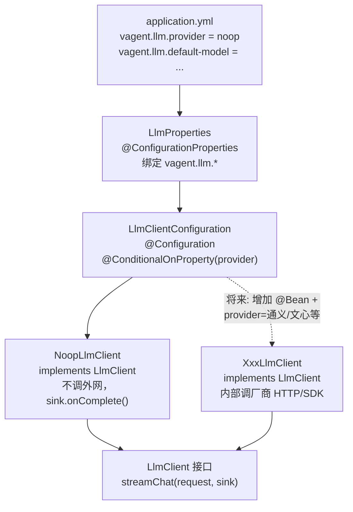

# M0 实现说明（Spring Boot 地基 + LLM 接口骨架）

本文档说明 Vagent 在 **M0 里程碑** 中已实现的内容：目标是什么、从哪读起、各文件职责与关系、为何这样设计、如何自测。  
对应策划书中的 **M0：仓库与空应用——可启动、健康检查**；并包含 **LLM 可替换接口骨架**（不接真实厂商）。

---

## 1. M0 要达成什么

| 目标 | 说明 |
|------|------|
| 可启动的 Web 进程 | 使用 Spring Boot 内嵌 Tomcat，非控制台 `main` 打印。 |
| 可观测 | 暴露 Actuator，至少能通过 `/actuator/health` 判断服务存活。 |
| LLM 边界清晰 | 业务将来只依赖 `LlmClient` 接口；具体厂商在 `impl` 中实现，通过配置切换。 |
| 可自动化验证 | `mvn test` 能加载完整 Spring 上下文，避免「本地能跑、CI 挂」的隐性错误。 |

**M0 刻意不包含**：会话/用户、数据库、pgvector、RAG 主链路编排、SSE、真实大模型调用。这些属于 M1 及以后。

---

## 2. 推荐阅读顺序（读代码时）

1. `pom.xml` —— 工程坐标、依赖、打包方式。  
2. `src/main/java/com/vagent/VagentApplication.java` —— JVM 唯一入口。  
3. `src/main/resources/application.yml` —— 端口、Actuator、`vagent.llm` 配置。  
4. `com.vagent.llm` 包（自下而上理解契约）：  
   - `LlmStreamSink` → `LlmMessage` / `LlmChatRequest` → `LlmClient`  
5. `com.vagent.llm.config` —— `LlmProperties`、`LlmClientConfiguration`。  
6. `com.vagent.llm.impl.NoopLlmClient` —— 当前默认实现。  
7. `src/test/java/com/vagent/VagentApplicationTests.java` —— 冒烟测试。

---

## 3. LLM 模块：从配置到实现（图 + 表）

本节专门说明 **`com.vagent.llm`**：配置如何落到具体 Bean，与运行时装配顺序一致。

### 3.1 流程图



**读图要点：**

- **业务/编排层**只依赖 **`LlmClient`**，不依赖 `NoopLlmClient` 或某厂商类。  
- 换厂商时：**新增实现类** + **在 `LlmClientConfiguration` 里为对应 `provider` 注册 Bean** + **改 yml**，不必改编排主代码。

### 3.2 类型与职责对照表

| 文件 / 类型 | 作用 |
|-------------|------|
| **`LlmClient`（接口）** | 约定一次流式对话如何调用、结果如何回来：`streamChat(request, sink)`。这是**稳定边界**，编排层只面向它编程。 |
| **`LlmChatRequest` / `LlmMessage`** | 请求侧数据模型：多轮消息列表、角色（SYSTEM/USER/ASSISTANT）、模型名等。避免方法参数零散、后续扩展温度/工具参数时只扩这里。 |
| **`LlmStreamSink`（接口）** | 流式结果回调：`onChunk` / `onComplete` / `onError`，与 SSE「边生成边推」及错误结束一致。 |
| **`LlmProperties`** | 从 `application.yml` 的 `vagent.llm.*` 读取 `provider`、`default-model`，和代码解耦。 |
| **`LlmClientConfiguration`** | 根据 `provider` 用 `@ConditionalOnProperty` 等条件**注册**对应的 `LlmClient` Bean；新增厂商时在此增加 `@Bean` 或新的条件分支。 |
| **`NoopLlmClient`** | **占位实现**：不请求真实 API，直接 `onComplete()`，保证未接厂商时应用能启动、测试能过；**不阻塞**后续开发。 |

### 3.3 源码路径速查

| 路径 | 说明 |
|------|------|
| `src/main/resources/application.yml` | `vagent.llm` 配置 |
| `com.vagent.llm.LlmClient` | 接口 |
| `com.vagent.llm.LlmChatRequest` / `LlmMessage` | 请求与消息 |
| `com.vagent.llm.LlmStreamSink` | 回调接口 |
| `com.vagent.llm.config.LlmProperties` | 配置属性 |
| `com.vagent.llm.config.LlmClientConfiguration` | Bean 装配 |
| `com.vagent.llm.impl.NoopLlmClient` | 当前默认实现 |

---

## 4. 整体关系（应用级心智图）

```
pom.xml
  └─ 引入 Spring Boot、Web、Actuator、测试、打包插件

VagentApplication.main
  └─ SpringApplication.run → 扫描 com.vagent、加载 application.yml、启动 Tomcat

application.yml
  └─ server.port / management.* / vagent.llm.*

vagent.llm.*
  └─ LlmProperties（绑定配置）
       └─ LlmClientConfiguration（按 provider 注册 Bean）
            └─ NoopLlmClient implements LlmClient（占位，不调外网）

验收
  └─ GET /actuator/health ； mvn test
```

---

## 5. 文件与职责

### 5.1 构建与入口

| 路径 | 作用 |
|------|------|
| `pom.xml` | Maven 项目描述：`groupId`/`artifactId`、继承 `spring-boot-starter-parent`、`spring-boot-starter-web`（MVC + 内嵌 Tomcat）、`spring-boot-starter-actuator`（健康检查等）、`spring-boot-configuration-processor`（自定义配置 IDE 提示）、`spring-boot-starter-test`、`spring-boot-maven-plugin`（可执行 fat jar）。 |
| `com.vagent.VagentApplication` | `@SpringBootApplication` 启动类：`main` 中调用 `SpringApplication.run`，触发组件扫描与自动配置。 |

### 5.2 运行时配置

| 路径 | 作用 |
|------|------|
| `src/main/resources/application.yml` | 配置监听端口；限制暴露的 Actuator 端点（如 `health`、`info`）；`vagent.llm.provider` 等自定义项。 |

### 5.3 LLM 抽象层

**详细流程图与类型说明见上文 §3**；此处仅列入口文件。

| 路径 | 作用 |
|------|------|
| `com.vagent.llm.*` | 接口与 DTO、回调、配置类、`NoopLlmClient` 实现，见 §3.3。 |

### 5.4 测试

| 路径 | 作用 |
|------|------|
| `VagentApplicationTests` | `@SpringBootTest` 加载完整应用上下文；方法体可为空，「能启动即通过」，用于尽早发现配置与 Bean 装配问题。 |

---

## 6. 为什么这样实现

| 设计选择 | 原因 |
|----------|------|
| Spring Boot | 策划书要求可部署、可观测、后续接 REST/SSE/数据访问；统一配置与依赖管理，减少自建基础设施。 |
| Actuator | 用标准方式提供健康检查，满足「能证明进程正常」的验收，且利于以后接 K8s 探针等。 |
| `LlmClient` 接口 + 多实现 | 国内厂商协议各异；接口隔离后换厂商只改 `impl` 与配置，主链路编排不绑死 SDK。 |
| 回调式 `LlmStreamSink` | 与流式生成、SSE 推送、后续取消（taskId/stop）的形态一致，避免过早把核心绑到某一响应式框架。 |
| `noop` 默认实现 | 在厂商未定时不阻塞工程；显式占位，避免业务代码散落 `if (mock)`。 |
| `vagent.*` 配置前缀 | 与 Spring 自带键区分，避免命名冲突，文档与排查更清晰。 |

---

## 7. 与策划书 §3 的关系（避免误解）

策划书 **§3** 描述的是 **完整 RAG 主链路**（记忆 → 改写 → 意图 → 检索 → Prompt → 流式 LLM → 取消等）。

**M0 不实现该主链路**，只完成：

- 服务进程与 **健康检查**；
- **LLM 流式调用**在代码结构上的抽象位置（`LlmClient` + `LlmStreamSink`），对应 §3 中「流式调用 LLM」能力的**接入点**，具体实现留到后续里程碑。

---

## 8. 如何自测

在项目根目录执行：

```bash
mvn test
```

启动应用后访问（端口以 `application.yml` 为准，默认 8080）：

```text
http://localhost:8080/actuator/health
```

应返回表示应用 **UP** 的 JSON。

---

## 9. 后续里程碑衔接（预告）

| 里程碑 | 典型内容（非 M0 范围） |
|--------|------------------------|
| M1 | 用户/会话领域模型与 API、最小鉴权或单用户占位。 |
| M2 | PostgreSQL + pgvector、入库与检索最小闭环。 |
| M3 | SSE、流式 LLM 真实适配、`LlmClient` 新实现、取消句柄。 |
| M4+ | 对齐策划书 §3 的编排主链路。 |

与 §3 有意的简化或偏差应记录在 `docs/DECISIONS.md`（若尚未创建，可在首次做决策时补充）。

---

## 10. 修订说明

| 版本 | 日期 | 说明 |
|------|------|------|
| 1.0 | 2026-04-03 | 初稿：对应当前仓库 M0 实现 |
| 1.1 | 2026-04-03 | 补充：后续里程碑见 [M1-实现说明.md](M1-实现说明.md) |
| 1.2 | 2026-04-03 | LLM 流程图与类型表并入 §3，不再单独文档 |

---

## 11. 后续里程碑（M1+）

用户与会话、JWT 等见 **[M1-实现说明.md](M1-实现说明.md)**。
