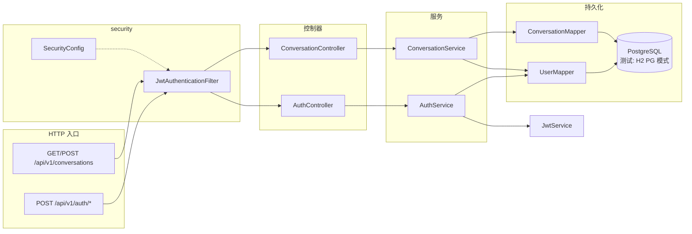
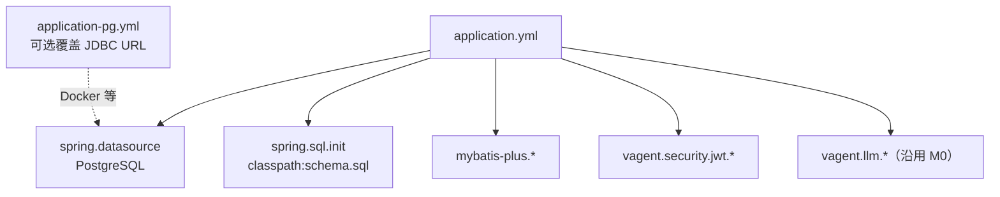
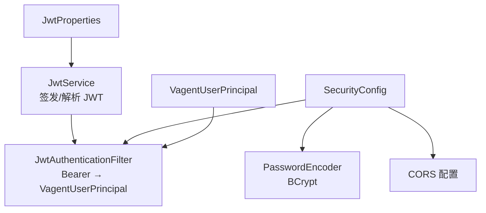
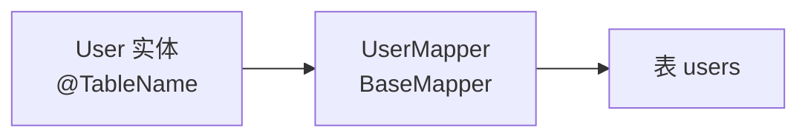
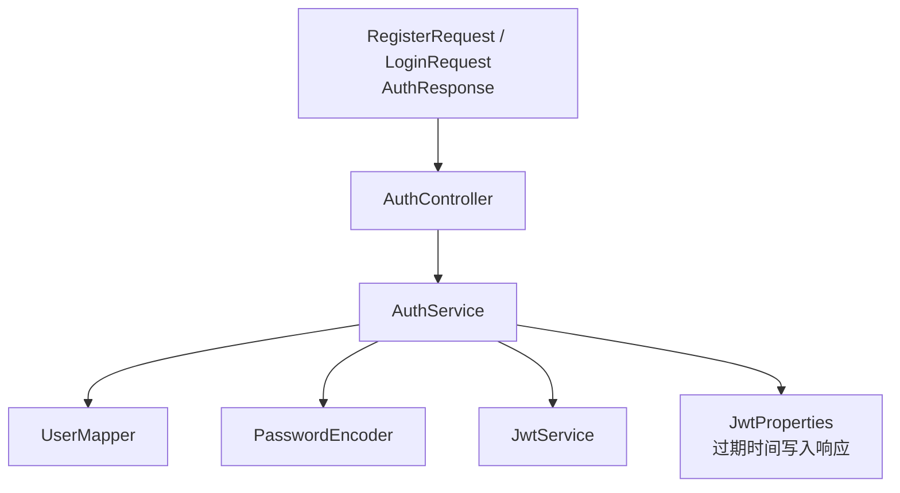
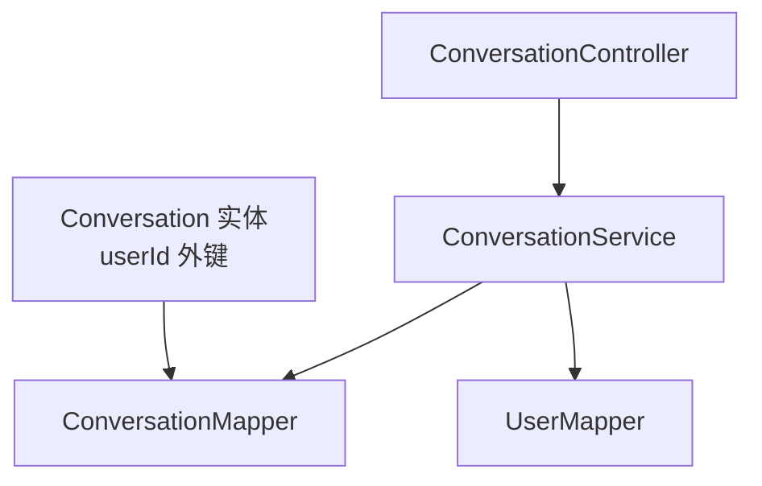
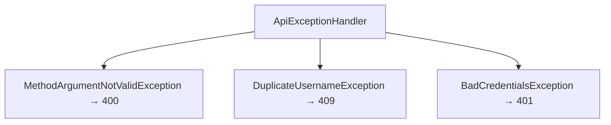
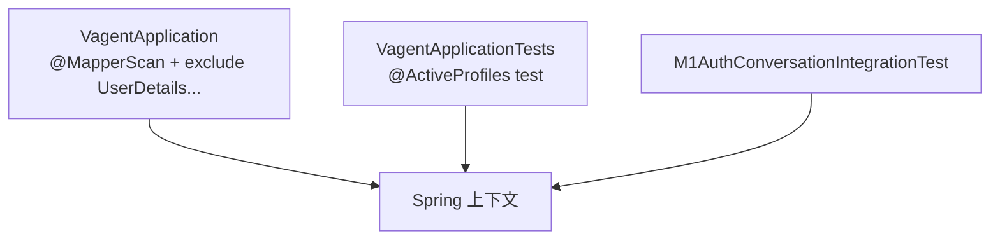

# M1 实现说明（用户、JWT 认证、会话 API）

本文档说明 **M1 里程碑** 的实现内容：与 M0 的关系、从哪读起、**按模块的结构图与类型表**、配置与安全注意、如何自测。  
对应策划书中的 **M1：用户与会话——登录 + 会话 API**。

---

## 1. M1 要达成什么

| 目标 | 说明 |
|------|------|
| 多用户隔离基础 | 持久化用户（用户名 + 密码哈希），后续消息/检索均带 `user_id` 条件。 |
| 注册与登录 | REST API 返回 JWT，客户端以 `Authorization: Bearer <token>` 调用受保护接口。 |
| 会话（conversation） | 创建与列表，产出 `conversationId`（UUID 字符串）来源。 |
| 可替换数据层 | 默认 **PostgreSQL** 长期存储（与后续 **pgvector** 同库）；`mvn test` 使用 **test profile + H2（PostgreSQL 模式）** 无需本机 PG。 |
| 可测试 | `mvn test` 含集成测试，覆盖注册→建会话→列表主路径。 |

**M1 刻意不包含**：消息内容存储、RAG 主链路、SSE、真实 LLM（仍为 `noop`）。

---

## 2. 与 M0 的关系

- **保留**：`VagentApplication`、Actuator、`LlmClient` 骨架与 `noop` 实现。  
- **新增**：**MyBatis-Plus**、**PostgreSQL** 驱动、Spring Security（无状态 JWT）、用户与会话表及 REST。  
- **启动类调整**：`@MapperScan("com.vagent")`；排除 `UserDetailsServiceAutoConfiguration`，避免 Spring Boot 自动生成内存用户与随机密码。

---

## 3. 推荐阅读顺序（读代码时）

1. `schema.sql` + `application.yml` —— PostgreSQL DDL、数据源、`spring.sql.init`、`mybatis-plus`、`vagent.security.jwt`。  
2. `application-pg.yml` —— 可选：仅覆盖 JDBC URL（如 Docker 服务名）；默认库已在 `application.yml`。  
3. `com.vagent.security` —— JWT 与过滤器。  
4. `com.vagent.user` —— `User`、`UserMapper`、`UserIdFormats`（库内主键为无连字符 UUID 串）。  
5. `com.vagent.conversation` —— `Conversation`、`ConversationMapper`、`ConversationService`、`ConversationController`。  
6. `com.vagent.auth` —— `AuthService`、`AuthController`、DTO。  
7. `com.vagent.api.ApiExceptionHandler`。  
8. `src/test/resources/application-test.yml`、`mockito-extensions/`（JDK 21 部分环境下避免 Mockito agent 问题）+ `@ActiveProfiles("test")`。  
9. `M1AuthConversationIntegrationTest`。

---

## 4. 按模块：结构图与类型表

### 4.1 总览（请求如何穿过各模块）



| 环节 | 说明 |
|------|------|
| **security** | 白名单放行 `/api/v1/auth/**`；其余 `/api/v1/**` 需 JWT；过滤器解析 Bearer 并写入 `SecurityContext`。 |
| **auth** | 注册/登录写 `User`、签发 Token，不经过会话控制器。 |
| **conversation** | 从 `SecurityContext` 取当前用户，只操作属于该用户的 `Conversation`。 |

---

### 4.2 配置与数据源模块

**涉及文件：** `application.yml`、`application-pg.yml`



| 文件 / 配置项 | 作用 |
|---------------|------|
| `schema.sql` | `users`、`conversations` 的 **PostgreSQL** DDL；测试时由 H2 `MODE=PostgreSQL` 执行同脚本。 |
| `application.yml` | 默认 **PostgreSQL** 连接；`spring.sql.init.mode=always` 开发期执行建表（生产建议 `never` + Flyway）。 |
| `application-test.yml` | **仅 test profile**：内存 H2（PostgreSQL 兼容模式）+ 同一份 `schema.sql`。 |
| `application-pg.yml` | 可选 profile，用于覆盖 `spring.datasource.url` 等；**业务与 M2 向量默认同一 PG 实例**。 |
| `vagent.security.jwt.*` | JWT 密钥与过期时间。 |

---

### 4.3 `com.vagent.security`（JWT 与访问控制）



| 类型 / 文件 | 作用 |
|-------------|------|
| `JwtProperties` | 绑定 `vagent.security.jwt.*`。 |
| `JwtService` | `createAccessToken(User)`、`parseAccessToken(String)`；subject 为库内主键（32 位 hex），解析为 `UUID` 后与 `UserIdFormats.compact` 配合查库。 |
| `VagentUserPrincipal` | 实现 `UserDetails`，承载 `userId` + `username`，供 `@AuthenticationPrincipal` 使用。 |
| `JwtAuthenticationFilter` | 从 `Authorization: Bearer` 解析；非法 Token 直接 401；`/api/v1/auth/**` 与 `/actuator/**` 不解析。 |
| `SecurityConfig` | 无状态 Session、关闭 CSRF、URL 授权、注册过滤器、统一 401 JSON、`PasswordEncoder` Bean。 |

---

### 4.4 `com.vagent.user`（用户实体）



| 类型 / 文件 | 作用 |
|-------------|------|
| `User` | MyBatis-Plus 实体：`@TableId(ASSIGN_UUID)` 主键字符串、`username`、`passwordHash`、`createdAt`（`LocalDateTime`）。 |
| `UserMapper` | `BaseMapper<User>`；条件查询用 `Wrappers.lambdaQuery`。 |
| `UserIdFormats` | `UUID`（带连字符）↔ 库内 32 位主键字符串的归一化，供会话服务按 `user_id` 查询。 |

---

### 4.5 `com.vagent.auth`（注册与登录）



| 类型 / 文件 | 作用 |
|-------------|------|
| `AuthController` | `POST /api/v1/auth/register`、`/login`，入参校验 `@Valid`。 |
| `AuthService` | 注册（BCrypt 存哈希）、登录（比对哈希）、组装 `AuthResponse`（含 `token`、`userId`）。 |
| `RegisterRequest` / `LoginRequest` | 校验用户名长度、密码长度等。 |
| `AuthResponse` | `token`、`tokenType`、`expiresInSeconds`、`userId`。 |

---

### 4.6 `com.vagent.conversation`（会话）



| 类型 / 文件 | 作用 |
|-------------|------|
| `Conversation` | 主键字符串、`userId` 外键、`title`、`createdAt`；不嵌套 `User` 对象。 |
| `ConversationMapper` | `BaseMapper` + `Wrappers` 按 `user_id` 倒序列表。 |
| `ConversationService` | `UserIdFormats.compact` 转换当前用户；`selectById` 校验用户存在后 `insert`。 |
| `ConversationController` | `GET/POST /api/v1/conversations`，`@AuthenticationPrincipal VagentUserPrincipal`。 |
| `ConversationResponse` / `CreateConversationRequest` | 对外 JSON 与创建入参。 |

---

### 4.7 `com.vagent.api`（统一异常）



| 类型 / 文件 | 作用 |
|-------------|------|
| `ApiExceptionHandler` | `@RestControllerAdvice`，返回 JSON：`error` / `message` / 校验 `fields`。 |
| `DuplicateUsernameException` | 注册时用户名冲突。 |

---

### 4.8 启动类与测试



| 文件 | 作用 |
|------|------|
| `VagentApplication` | `@MapperScan("com.vagent")` 扫描 `*Mapper`；排除默认 `UserDetailsService` 自动配置。 |
| `VagentApplicationTests` / `M1AuthConversationIntegrationTest` | `@ActiveProfiles("test")` 走 H2，不依赖本机 PostgreSQL。 |
| `M1AuthConversationIntegrationTest` | 注册 → 带 Token 列会话 → 建会话 → 再列；未登录 401。 |

---

## 5. API 一览

| 方法 | 路径 | 认证 | 说明 |
|------|------|------|------|
| POST | `/api/v1/auth/register` | 否 | 注册，201 + `token` / `userId` 等 |
| POST | `/api/v1/auth/login` | 否 | 登录，200 + `token` |
| GET | `/api/v1/conversations` | Bearer | 当前用户的会话列表 |
| POST | `/api/v1/conversations` | Bearer | 创建会话，body 可省略或 `{"title":"..."}` |

错误体统一为 JSON：`error` / `message`（校验失败时另有 `fields`）。

---

## 6. 配置说明

| 键 | 含义 |
|----|------|
| `spring.datasource.*` | 默认指向 **PostgreSQL**（需先建库与用户，见 README）。 |
| `spring.sql.init.*` | 开发期执行 `schema.sql`；**生产建议 `mode: never` 并改用 Flyway**。 |
| `mybatis-plus.configuration.map-underscore-to-camel-case` | 下划线列名映射驼峰字段。 |
| `vagent.security.jwt.secret` | HS256 密钥（≥32 字符）；生产用环境变量覆盖。 |
| `vagent.security.jwt.expiration-seconds` | Access Token 有效期（秒）。 |

环境变量覆盖示例（Spring relaxed binding）：

```text
VAGENT_SECURITY_JWT_SECRET=你的长随机串
```

---

## 7. 安全注意

- JWT 密钥勿提交到公开仓库；生产使用强随机密钥并轮换策略视需求而定。  
- CORS 当前为开发友好宽松配置，上线应收紧为具体前端域名。  
- 密码使用 BCrypt；登录失败返回统一文案，避免枚举用户名。

---

## 8. 如何自测

```bash
mvn test
```

手动示例（默认端口 8080，**需本机 PostgreSQL 已建库且账号与 `application.yml` 一致**）：

1. `POST /api/v1/auth/register`，Body：`{"username":"u1","password":"password12"}`  
2. 复制响应中的 `token`  
3. `GET /api/v1/conversations`，Header：`Authorization: Bearer <token>`

`mvn test` 使用 **test profile**，无需本机 PostgreSQL。

---

## 9. 后续里程碑衔接

| 里程碑 | 内容 |
|--------|------|
| M2 | PostgreSQL + pgvector、分块入库与检索 API。 |
| M3 | SSE、真实 `LlmClient` 实现、取消句柄。 |
| M4+ | 对齐策划书 §3 的编排主链路（记忆、改写、意图、检索等）。 |

---

## 10. 修订说明

| 版本 | 日期 | 说明 |
|------|------|------|
| 1.0 | 2026-04-03 | 初稿：JWT + 用户 + 会话 API |
| 1.1 | 2026-04-03 | 按模块补充 Mermaid 图与类型表（§4） |
| 1.2 | 2026-04-04 | 持久层改为 MySQL + MyBatis-Plus（已弃用） |
| 1.3 | 2026-04-04 | 默认库改为 **PostgreSQL**（与 pgvector 同库路线）；测试 H2 `MODE=PostgreSQL`；移除 MySQL 驱动 |
