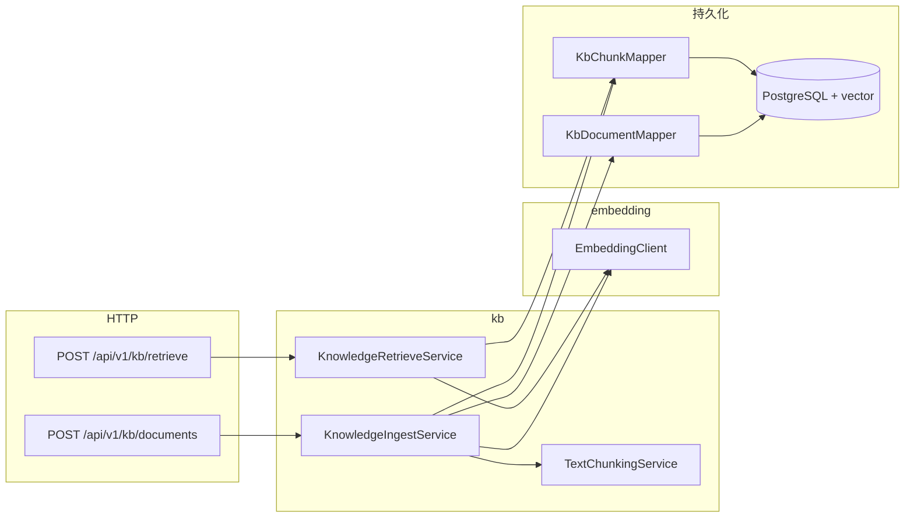

# M2 实现说明（pgvector 知识库、嵌入、检索 API）

本文档说明 **M2 里程碑** 的实现内容：与 M0/M1 的关系、推荐阅读顺序、**模块结构图与类型表**、PostgreSQL/pgvector 注意、如何自测。  
对应策划书中的 **知识库与向量检索** 基础能力。

---

## 1. M2 要达成什么

| 目标 | 说明 |
|------|------|
| 同库向量存储 | 在 **PostgreSQL** 上启用 **pgvector**，与业务表同库；DDL 拆为 `schema-core.sql`（核心表）与 `schema-vector.sql`（扩展 + 向量表）。 |
| 可替换嵌入 | `EmbeddingClient` + 默认 **hash** 实现（确定性、L2 归一化、维度可配，须与 `vector(N)` 一致）。 |
| 分块入库 | 按字符窗口 + 重叠切分正文，写入 `kb_documents` / `kb_chunks`。 |
| 向量检索 | 查询句嵌入后，按余弦距离运算符 `<=>` 取 Top-K（开发期顺序扫描；大数据量再建 ANN 索引）。 |
| REST | `POST /api/v1/kb/documents`、`POST /api/v1/kb/retrieve`（需 JWT）。 |
| 测试 | 默认 `mvn test` 仍用 **H2 + schema-core**（无向量表）；**pgvector 路径** 由 `M2KnowledgeVectorIntegrationTest`（Testcontainers）覆盖，默认从 Surefire 排除，需单独运行（见 §7）。 |

**M2 刻意不包含**：真实 Embedding API、流式对话中的检索编排、ANN 索引调优、按 token 的智能切分。

---

## 2. 与 M0/M1 的关系

- **保留**：JWT、用户隔离、`UserIdFormats.compact`、MyBatis-Plus、`/api/v1/auth/*`、会话 API。  
- **新增**：`com.vagent.embedding`、`com.vagent.kb`、pgvector JDBC 类型、`com.pgvector:pgvector`。  
- **DDL**：主配置依次执行 `schema-core.sql`、`schema-vector.sql`；**test profile** 仅执行 `schema-core.sql`，避免 H2 执行 `CREATE EXTENSION vector`。

---

## 3. 推荐阅读顺序

1. `schema-core.sql`、`schema-vector.sql`、`application.yml`（`spring.sql.init.schema-locations`、`vagent.embedding.*`）。  
2. `com.vagent.embedding` — `EmbeddingProperties`、`HashEmbeddingClient`、`EmbeddingClientConfiguration`。  
3. `com.vagent.kb` — `TextChunkingService`、`KbDocument`/`KbChunk`、`PgVectorFloatArrayTypeHandler`。  
4. `KnowledgeIngestService`、`KnowledgeRetrieveService`、`KnowledgeController` 与 `dto`。  
5. `M2KnowledgeVectorIntegrationTest`、`HashEmbeddingClientTest`。

---

## 4. 按模块：结构图与类型表

### 4.1 总览



| 环节 | 说明 |
|------|------|
| **ingest** | 校验用户存在 → 插入文档 → 分块 → 每块 `embed` → 插入 `kb_chunks`。 |
| **retrieve** | 对查询句 `embed` → `VectorFormats.toPgVectorLiteral` → `KbChunkMapper#searchNearest`。 |

### 4.2 配置项（`vagent.embedding`）

| 属性 | 默认 | 说明 |
|------|------|------|
| `provider` | `hash` | `hash` 本地可复现；`dashscope` 为 U2 通义千问兼容嵌入（见 [U2-实现说明.md](U2-实现说明.md)）。 |
| `dimensions` | `1024` | **须**与 `kb_chunks.embedding vector(N)`、`KbChunkMapper` 中 `CAST(... AS vector(N))` 一致；改维度需同步改 DDL 并重嵌入。 |
| `chunk-max-chars` | `512` | 单块最大字符数。 |
| `chunk-overlap` | `64` | 块重叠；须小于 `chunk-max-chars`。 |

### 4.3 数据库与扩展

- 首次在库中安装扩展通常需要 **超级用户** 或已授权角色：`CREATE EXTENSION IF NOT EXISTS vector;`（已写在 `schema-vector.sql` 首部）。  
- `schema-vector.sql` 中 **未** 预建 IVFFLAT/HNSW：小数据量顺序扫描即可；上生产前按数据量调 `lists` / `m` 等参数并 `ANALYZE`。

---

## 5. REST 摘要

| 方法 | 路径 | 说明 |
|------|------|------|
| `POST` | `/api/v1/kb/documents` | Body：`title`、`content`；响应：`documentId`、`chunkCount`。 |
| `POST` | `/api/v1/kb/retrieve` | Body：`query`、`topK`（默认 5，最大 50）；响应：`hits[]`（`chunkId`、`documentId`、`content`、`distance`）。 |

`distance` 为 pgvector 余弦距离 `<=>`，**越小越相似**（向量已 L2 归一化）。

---

## 6. 安全

与 M1 相同：`/api/v1/kb/**` 需 `Authorization: Bearer <token>`；检索与入库均带当前用户 `user_id` 条件。

---

## 7. 测试说明

| 测试类 | 作用 |
|--------|------|
| `HashEmbeddingClientTest` | 单元测试：维度与 L2 归一化。 |
| `M1AuthConversationIntegrationTest` | 回归 M1 主路径（H2）。 |
| `M2KnowledgeVectorIntegrationTest` | Docker + `pgvector/pgvector:pg16` 镜像，全链路入库与检索。 |

默认 Surefire **排除** `M2KnowledgeVectorIntegrationTest`（首次拉取镜像较慢）。需要验证 pgvector 时在本机安装 Docker 后执行：

```bash
mvn test -Dtest=M2KnowledgeVectorIntegrationTest
```

若未安装 Docker，类上 `@EnabledIf`（`DockerClientFactory#isDockerAvailable`）会跳过该测试（在 **不显式** 指定 `-Dtest=...` 时，因已排除，一般不会执行到该类）。

---

## 8. 已知限制与后续

- **hash 嵌入** 无语义，仅用于联调与结构验证；对接真实模型时替换 `EmbeddingClient` 实现并统一维度。  
- **检索** 为单路向量 Top-K，无重排、无混合检索。  
- **IVFFLAT/HNSW** 待数据量与延迟要求明确后再建并调参。
