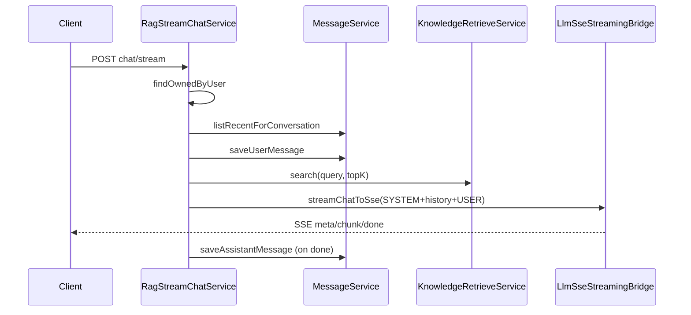

# M4 实现说明（多轮消息、RAG 编排）

本文档说明 **M4 里程碑**：在 `schema-core.sql` 中新增 **`messages`** 表，提供「读最近历史 + 写 USER/ASSISTANT」服务；在 **`vagent.rag.enabled=true`**（默认）时，流式对话走 **鉴权 → 读历史 → 落库用户句 → 向量检索 → 拼 SYSTEM+历史+当前 USER → SSE → 落库助手** 的完整主链路；关闭 RAG 时保持 M3 单条 USER 行为。

**M5 补充**：在 M4 链路上增加检索前改写与意图分支，见 [M5-实现说明.md](M5-实现说明.md)。

---

## 1. M4 要达成什么

| 目标 | 说明 |
|------|------|
| 持久化多轮 | 表 `messages`：`conversation_id`、`user_id`、`role`（USER/ASSISTANT）、`content`、`created_at`；删会话级联删消息。 |
| RAG 编排 | `KnowledgeRetrieveService#search` 的 Top-K 片段写入 **SYSTEM**（不落库）；历史 USER/ASSISTANT 来自表；当前用户句单独追加为最后一条 USER。 |
| 配置 | `vagent.rag.enabled`（默认 `true`）、`top-k`、`max-history-messages`。 |
| SSE | 首条 `meta` 在 RAG 模式下额外包含 **`hitCount`**（检索命中条数）；其余 `chunk` / `done` / `cancelled` / `error` 与 M3 一致。 |
| 兼容 | `vagent.rag.enabled=false` 时，`StreamChatService` 不访问 `messages`、不检索 KB，与 M3 单 USER 请求等价。 |

**测试说明**：`application-test.yml` 中 **关闭 RAG**（`vagent.rag.enabled: false`），因 H2 仅加载 `schema-core.sql`，无 `kb_chunks` 等向量表；否则会触发检索 Mapper 缺表失败。本地 PostgreSQL + 全量 schema 可开启 RAG 做联调。

---

## 2. 推荐阅读顺序（代码）

1. `schema-core.sql` — `messages` 表与索引。  
2. `com.vagent.chat.message` — `Message`、`MessageMapper`、`MessageService`（读最近 N 条、写 USER/ASSISTANT）。  
3. `com.vagent.chat.rag.RagProperties` + `ChatStreamingConfiguration`（`@EnableConfigurationProperties`）。  
4. `LlmSseStreamingBridge` — LLM 流 → SSE 与可取消任务的唯一实现，M3 简单路径与 M4 共用。  
5. `RagStreamChatService` — 主链路步骤注释（① 鉴权 … ⑦ 落库助手）。  
6. `StreamChatService` — 根据 `rag.enabled` 委托或走 M3 路径。  
7. `application.yml` / `application-test.yml` — `vagent.rag.*`。

---

## 3. 数据流（RAG 开启时）

---

## 4. 自测建议

- **本地 PG**：确保已执行 `schema-core.sql`（含 `messages`）与 `schema-vector.sql`；`vagent.rag.enabled=true`。  
- **入库文档**：`POST /api/v1/kb/documents` 后，对同一会话连续 `chat/stream`，观察 `meta.hitCount` 与回答是否引用片段。  
- **关闭 RAG**：`vagent.rag.enabled=false`，行为应与 M3 一致（且不写 `messages`）。  
- **fake-stream**：便于看分块输出；`noop` 无 chunk 但仍会 `done`，助手行可能为空字符串。

---

## 5. 与策划书的关系

对应《Vagent 项目策划书》中 **M4：RAG 编排与多轮** 的最小可运行实现：主链路可演示，后续可替换真实厂商流式 HTTP、增加重试与观测等。
